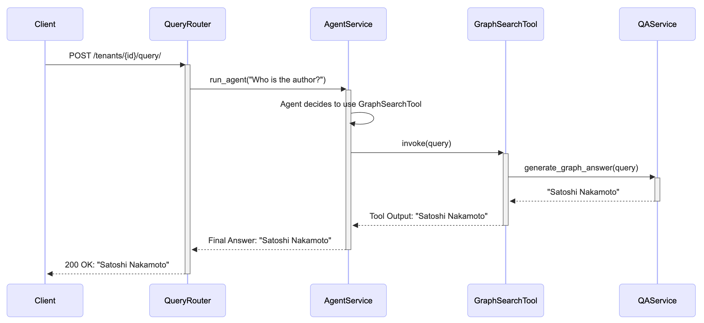

# CogniGraph: A Multi-Tenant AI-Powered Knowledge Assistant

CogniGraph is a scalable, multi-tenant AI platform designed for enterprise clients to securely upload private documents (PDFs) and query them using natural language. The system leverages a powerful combination of Retrieval-Augmented Generation (RAG) and a Knowledge Graph (KG) to provide accurate, cited, and context-aware answers through an intelligent AI agent.

This project is built using modern, production-grade technologies with a focus on clean architecture, scalability, and robust CI/CD automation for cloud deployment.

## Key Features

- **Multi-Tenant by Design:** Strict data isolation between tenants at the database and API level, proven with integration tests.
- **Hybrid Search:** Combines semantic vector search (RAG) for broad questions and structured graph search (KG) for specific, factual queries.
- **Intelligent AI Agent:** An LLM-powered agent that analyzes user questions and dynamically chooses the best tool (RAG or KG) to find the answer.
- **Asynchronous Processing:** Document uploads trigger a background Celery task for ingestion, ensuring the API remains responsive.
- **Streaming Responses:** The agent streams answers token-by-token for an interactive user experience.
- **Cloud-Native & Automated:** Fully containerized with Docker, with automated CI/CD pipelines using Terraform and GitHub Actions to deploy to Amazon EKS.

## Architecture

The application is designed with clean, decoupled architectural layers to ensure maintainability and separation of concerns.

**High-Level System Design:**


**AI Agent Query Flow:**
This diagram shows how a query is processed by the AI agent, which selects the appropriate tool to generate an answer.



**Continuous Integration:**

This diagram shows the CI workflow that runs on every pull request to the main branch.


**Continuous Deployment:**

This diagram shows the CD workflow that runs on every merge to the main branch.


**AWS Infrastructure:**

This diagram shows the AWS infrastructure that the application is deployed to.


## Tech Stack

| Component            | Technology                                | Purpose                                        |
| -------------------- | ----------------------------------------- | ---------------------------------------------- |
| **Backend Framework**| FastAPI                                   | High-performance, asynchronous API             |
| **AI Orchestration** | LangChain                                 | Building agent, tools, and QA chains           |
| **LLM Provider**     | OpenAI (gpt-4o)                           | AI reasoning, generation, and graph extraction |
| **Relational DB**    | PostgreSQL                                | Tenant metadata management                     |
| **Vector Store**     | PGVector                                  | Storing and searching document embeddings (RAG)|
| **Graph DB**         | Neo4j (with APOC plugin)                  | Storing and querying the Knowledge Graph (KG)  |
| **Async Tasks**      | Celery & Redis                            | Background processing for document ingestion   |
| **Containerization** | Docker & Docker Compose                   | Local development and production builds        |
| **Testing**          | Pytest, Pytest-Mock                       | Unit and integration testing                   |
| **Dependency Mgmt**  | pip-tools                                 | Reproducible, locked dependencies              |
| **Infrastructure**   | Terraform, Amazon EKS, RDS, ElastiCache   | Infrastructure as Code for a production env    |
| **CI/CD**            | GitHub Actions                            | Automated testing and deployment               |

## Local Setup & Usage

### Prerequisites
- Docker and Docker Compose
- Python 3.12 (for local venv, if not using Docker exclusively)
- An OpenAI API key

### Installation

1.  **Clone the repository:**
    ```bash
    git clone https://github.com/zhu-weijie/cogni-graph.git
    cd cogni-graph
    ```

2.  **Create the environment file:**
    Copy the example environment file and add your OpenAI API key. The other variables are pre-configured for the local Docker Compose setup.
    ```bash
    cp .env.example .env
    # Now, open the .env file and paste your OpenAI key
    # OPENAI_API_KEY="sk-..."
    ```

3.  **Build and start the services:**
    This command will build the Docker images and start all services (API, worker, Postgres, Neo4j, Redis).
    ```bash
    docker compose up -d --build
    ```

    

4.  **Access the services:**
    - **API Docs:** `http://localhost:8000/docs`
    - **Neo4j Browser:** `http://localhost:7474` (Connect to `neo4j://localhost:7687` with user `neo4j` and password `password`)

    
    

### API Endpoints Walkthrough

First, get a `TENANT_ID` to use in the following commands:
```bash
TENANT_ID=$(curl -s -X POST "http://localhost:8000/tenants/" -H "Content-Type: application/json" -d '{"name": "My Test Tenant"}' | grep -o '"id":"[^"]*' | cut -d'"' -f4)
echo "Using TENANT_ID: $TENANT_ID"
```


**1. Upload a Document (Async)**
This will upload the `bitcoin.pdf` (included in the repository) and start background processing.
```bash
TASK_ID=$(curl -s -X POST "http://localhost:8000/tenants/$TENANT_ID/upload" -F "file=@bitcoin.pdf" | grep -o '"task_id":"[^"]*' | cut -d'"' -f4)
echo "Started processing with Task ID: $TASK_ID"
```

**2. Check Processing Status**
Wait a few moments and check the status of the task. It will move from `PENDING` to `SUCCESS`.
```bash
# Wait ~30-40 seconds for processing to complete
sleep 40
curl "http://localhost:8000/tenants/$TENANT_ID/status/$TASK_ID"
```


List all Nodes by Type and ID
```cypher
MATCH (n)
RETURN labels(n) AS Type, n.id AS ID, n.tenant_id AS Tenant
ORDER BY Type, ID
```


List all Relationships
```cypher
MATCH (start_node)-[relationship]->(end_node)
RETURN 
    start_node.id AS StartNode, 
    type(relationship) AS RelationshipType, 
    end_node.id AS EndNode
```


**3. Query the Agent (Streaming)**
Once processing is complete, ask the agent a question.
```bash
# General question (will use the RAG)
curl -N -X POST "http://localhost:8000/tenants/$TENANT_ID/query/" \
-H "Content-Type: application/json" \
-d '{"query": "What is proof of work?"}'
```


```bash
# Answer to the general question with source
curl -X POST "http://localhost:8000/tenants/$TENANT_ID/query/generate" \
-H "Content-Type: application/json" \
-d '{"query": "What is incentive in Bitcoin?"}'
```


```bash
# Specific question (will use the Knowledge Graph)
curl -N -X POST "http://localhost:8000/tenants/$TENANT_ID/query/" \
-H "Content-Type: application/json" \
-d '{"query": "Who is the author of the bitcoin paper?"}'
```


## Testing

This project uses `pytest` for both unit and integration tests.

To run the full test suite in an isolated environment:
```bash
docker compose -f docker-compose.testing.yml run --rm tester
```
