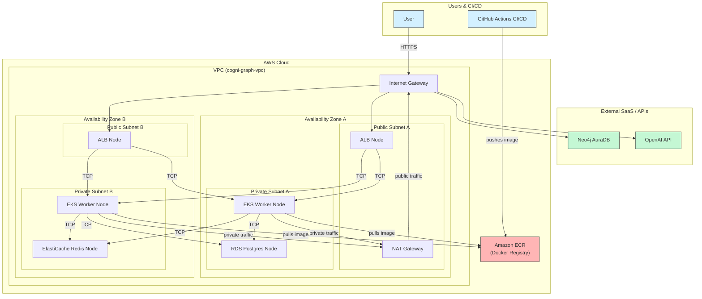

```mermaid
graph TD
    subgraph "Users & CI/CD"
        User
        GitHub_Actions[GitHub Actions CI/CD]
    end

    subgraph "External SaaS / APIs"
        AuraDB["Neo4j AuraDB"]
        OpenAI["OpenAI API"]
    end

    subgraph "AWS Cloud"
        ECR["Amazon ECR<br>(Docker Registry)"]

        subgraph "VPC (cogni-graph-vpc)"
            IGW[Internet Gateway]

            subgraph "Availability Zone A"
                subgraph "Public Subnet A"
                    ALB_A[ALB Node]
                    NAT_GW[NAT Gateway]
                end
                subgraph "Private Subnet A"
                    EKS_Node_A[EKS Worker Node]
                    RDS_A[RDS Postgres Node]
                end
            end
            
            subgraph "Availability Zone B"
                subgraph "Public Subnet B"
                    ALB_B[ALB Node]
                end
                subgraph "Private Subnet B"
                    EKS_Node_B[EKS Worker Node]
                    ElastiCache_B[ElastiCache Redis Node]
                end
            end

            %% Inbound Traffic Flow
            User -- HTTPS --> IGW --> ALB_A & ALB_B
            ALB_A & ALB_B -- TCP --> EKS_Node_A & EKS_Node_B

            %% Internal Traffic Flow
            EKS_Node_A & EKS_Node_B -- TCP --> RDS_A
            EKS_Node_A & EKS_Node_B -- TCP --> ElastiCache_B
            
            %% Outbound Traffic Flow to External Services
            EKS_Node_A & EKS_Node_B -- private traffic --> NAT_GW
            NAT_GW -- public traffic --> IGW
        end
    end

    %% CI/CD and External Service Connections
    GitHub_Actions -- pushes image --> ECR
    EKS_Node_A & EKS_Node_B -- pulls image --> ECR
    IGW --> AuraDB
    IGW --> OpenAI
    
    style User fill:#d3f0ff,stroke:#333
    style GitHub_Actions fill:#d3f0ff,stroke:#333
    style AuraDB fill:#c4f7d4,stroke:#333
    style OpenAI fill:#c4f7d4,stroke:#333
    style ECR fill:#ffb5b5,stroke:#333
```