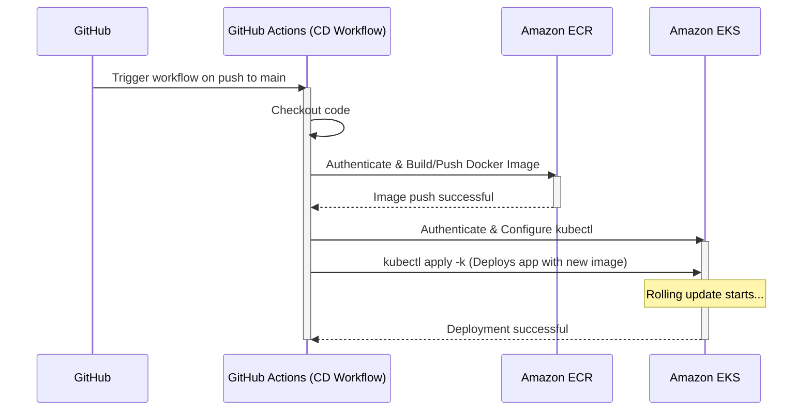

```mermaid
sequenceDiagram
    participant GitHub
    participant GitHub Actions (CD Workflow)
    participant Amazon ECR
    participant Amazon EKS

    GitHub->>GitHub Actions (CD Workflow): Trigger workflow on push to main
    activate GitHub Actions (CD Workflow)

    GitHub Actions (CD Workflow)->>GitHub Actions (CD Workflow): Checkout code
    
    GitHub Actions (CD Workflow)->>Amazon ECR: Authenticate & Build/Push Docker Image
    activate Amazon ECR
    Amazon ECR-->>GitHub Actions (CD Workflow): Image push successful
    deactivate Amazon ECR

    GitHub Actions (CD Workflow)->>Amazon EKS: Authenticate & Configure kubectl
    activate Amazon EKS
    
    GitHub Actions (CD Workflow)->>Amazon EKS: kubectl apply -k (Deploys app with new image)
    Note over Amazon EKS: Rolling update starts...
    Amazon EKS-->>GitHub Actions (CD Workflow): Deployment successful
    deactivate Amazon EKS

    deactivate GitHub Actions (CD Workflow)
```