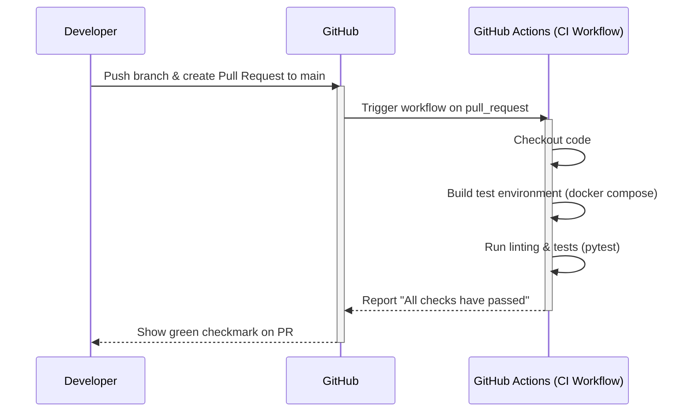

```mermaid
sequenceDiagram
    participant Developer
    participant GitHub
    participant GitHub Actions (CI Workflow)

    Developer->>GitHub: Push branch & create Pull Request to main
    activate GitHub

    GitHub->>GitHub Actions (CI Workflow): Trigger workflow on pull_request
    activate GitHub Actions (CI Workflow)

    GitHub Actions (CI Workflow)->>GitHub Actions (CI Workflow): Checkout code
    GitHub Actions (CI Workflow)->>GitHub Actions (CI Workflow): Build test environment (docker compose)
    GitHub Actions (CI Workflow)->>GitHub Actions (CI Workflow): Run linting & tests (pytest)

    GitHub Actions (CI Workflow)-->>GitHub: Report "All checks have passed"
    deactivate GitHub Actions (CI Workflow)

    GitHub-->>Developer: Show green checkmark on PR
    deactivate GitHub
```