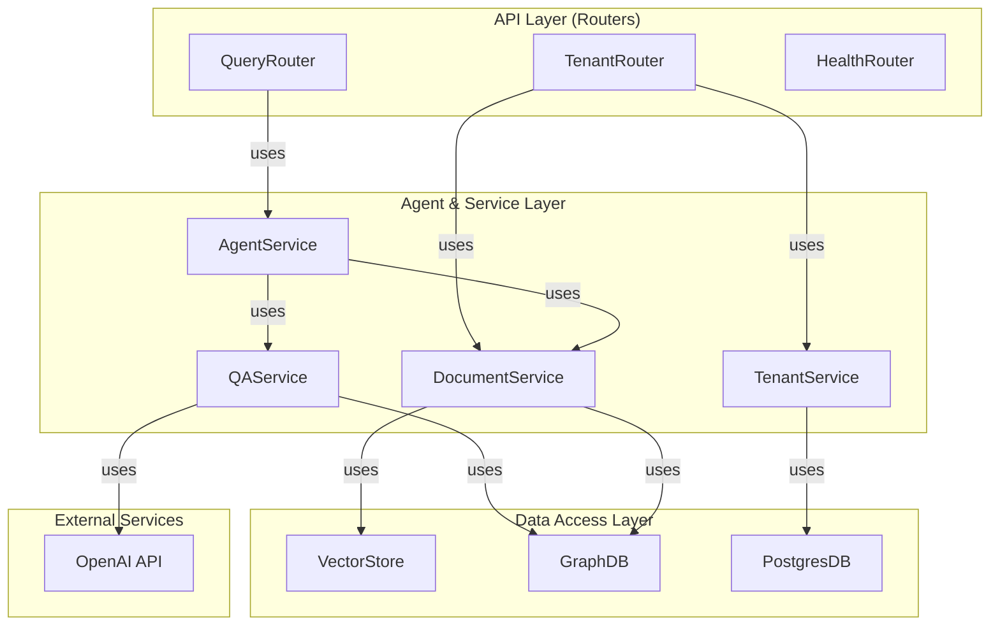

```mermaid
graph TD
    subgraph "API Layer (Routers)"
        A[QueryRouter]
        B[TenantRouter]
        C[HealthRouter]
    end

    subgraph "Agent & Service Layer"
        D[AgentService]
        E[QAService]
        F[DocumentService]
        G[TenantService]
    end

    subgraph "Data Access Layer"
        H[VectorStore]
        I[GraphDB]
        J[PostgresDB]
    end

    subgraph "External Services"
        K[OpenAI API]
    end

    A -- uses --> D
    B -- uses --> G
    B -- uses --> F

    D -- uses --> E
    D -- uses --> F
    E -- uses --> K
    E -- uses --> I

    F -- uses --> H
    F -- uses --> I

    G -- uses --> J
```
