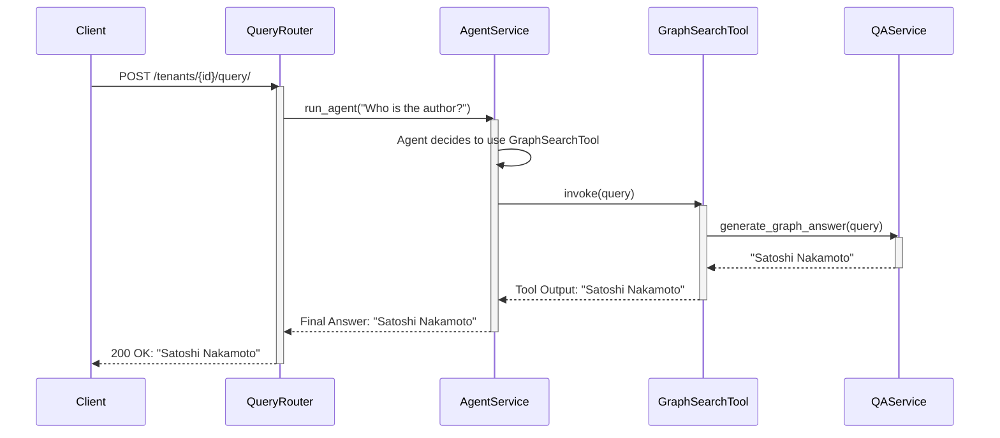

```mermaid
sequenceDiagram
    participant Client
    participant QueryRouter
    participant AgentService
    participant GraphSearchTool
    participant QAService

    Client->>QueryRouter: POST /tenants/{id}/query/
    activate QueryRouter

    QueryRouter->>AgentService: run_agent("Who is the author?")
    activate AgentService

    AgentService->>AgentService: Agent decides to use GraphSearchTool
    AgentService->>GraphSearchTool: invoke(query)
    activate GraphSearchTool

    GraphSearchTool->>QAService: generate_graph_answer(query)
    activate QAService
    QAService-->>GraphSearchTool: "Satoshi Nakamoto"
    deactivate QAService

    GraphSearchTool-->>AgentService: Tool Output: "Satoshi Nakamoto"
    deactivate GraphSearchTool

    AgentService-->>QueryRouter: Final Answer: "Satoshi Nakamoto"
    deactivate AgentService

    QueryRouter-->>Client: 200 OK: "Satoshi Nakamoto"
    deactivate QueryRouter
```
