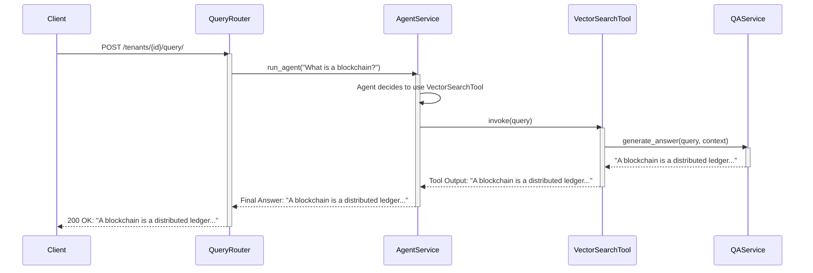

```mermaid
sequenceDiagram
    participant Client
    participant QueryRouter
    participant AgentService
    participant VectorSearchTool
    participant QAService

    Client->>QueryRouter: POST /tenants/{id}/query/
    activate QueryRouter

    QueryRouter->>AgentService: run_agent("What is a blockchain?")
    activate AgentService

    AgentService->>AgentService: Agent decides to use VectorSearchTool
    AgentService->>VectorSearchTool: invoke(query)
    activate VectorSearchTool

    %% The tool first retrieves documents and then generates an answer
    %% This diagram simplifies that into a single call to the QA service for clarity
    VectorSearchTool->>QAService: generate_answer(query, context)
    activate QAService
    QAService-->>VectorSearchTool: "A blockchain is a distributed ledger..."
    deactivate QAService

    VectorSearchTool-->>AgentService: Tool Output: "A blockchain is a distributed ledger..."
    deactivate VectorSearchTool

    AgentService-->>QueryRouter: Final Answer: "A blockchain is a distributed ledger..."
    deactivate AgentService

    QueryRouter-->>Client: 200 OK: "A blockchain is a distributed ledger..."
    deactivate QueryRouter
```